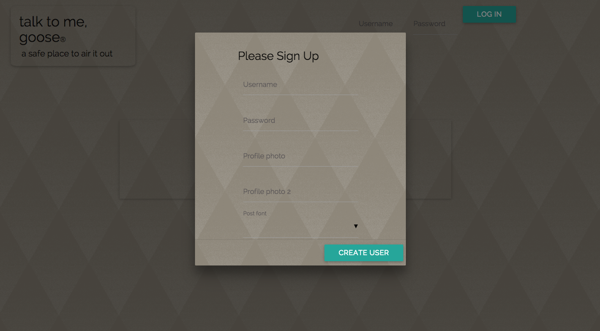
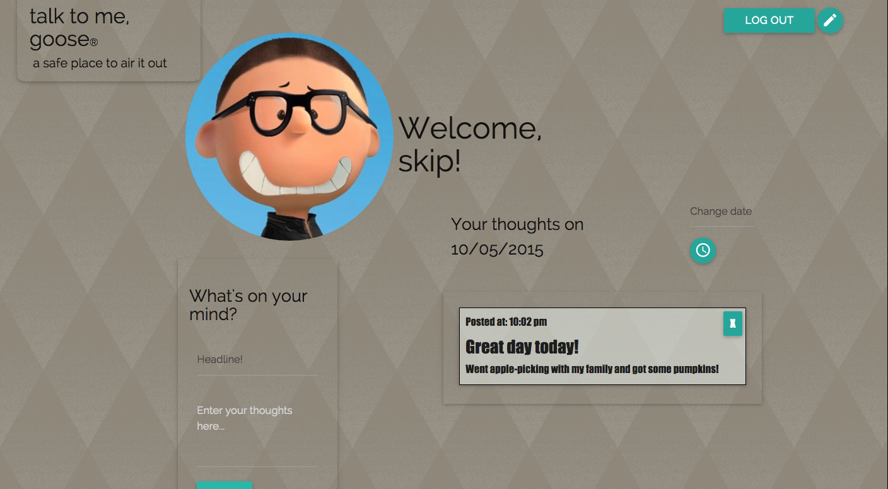
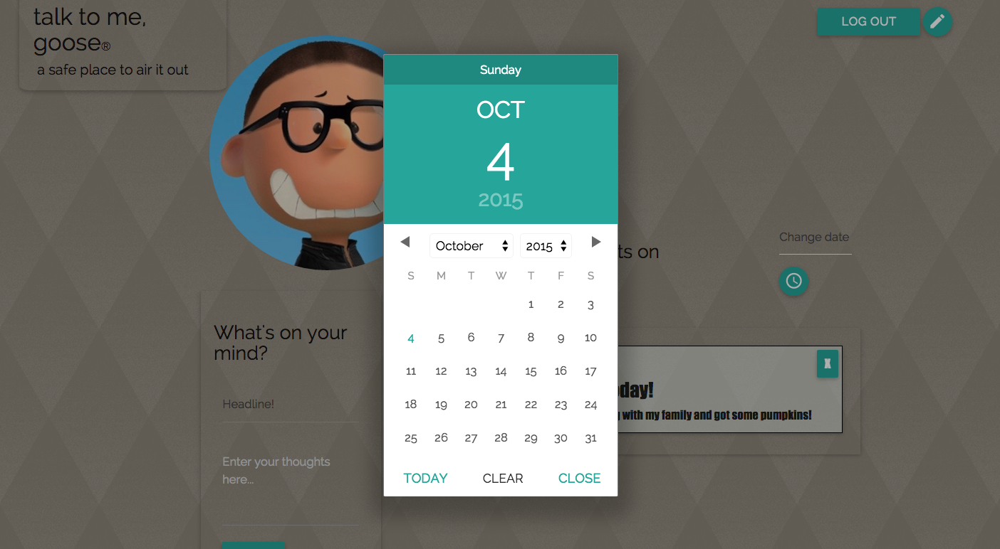
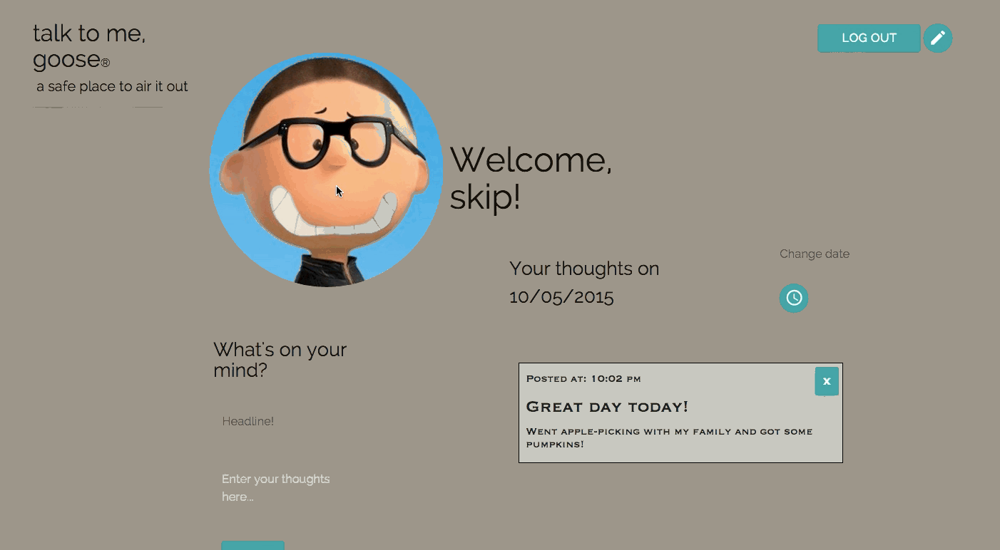

# talk to me goose

- talk to me goose is a two-page microjournaling application

---

---

- After signing up and logging in, users can add and remove journal entries, search entries by date, and customize the font of their entries

---

---

---

- A whimsical option allows the use to add a second profile pic which appears after clicking on the first pic

---

- Future versions will include greater customization of profile styling

##url

https://shielded-bastion-2125.herokuapp.com/

---

##Technologies

* Ruby on Rails
* Backbone.js
* PostgreSQL
* Materialize

***
